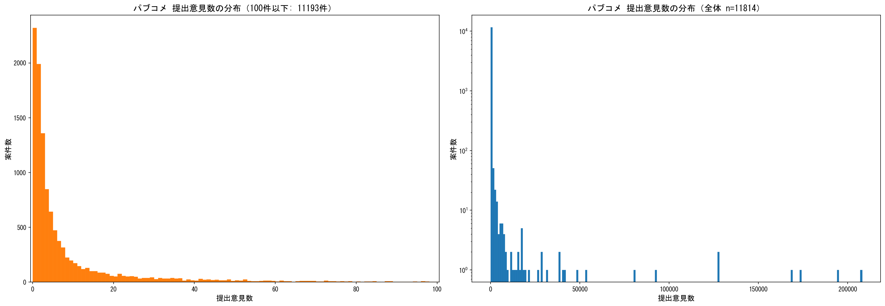
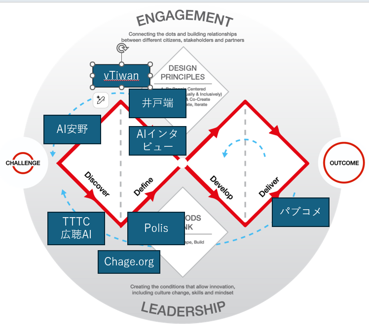

# 第3章 デジタル民主主義とブロードリスニング、新しい民意の届け方

文責：@tokoroten

## 本章の要点

1章ではブロードリスニングの三つの形態（ツールとしてのブロードリスニング、拡張熟議支援としてのブロードリスニング、政治家・行政主導のブロードリスニング）を示し、2章では「ツールとしてのブロードリスニング」の特性（定性分析、アジェンダ設定の開放、代表性の限界）を説明しました。

本章では残る二つの形態、**拡張熟議支援としてのブロードリスニング**と**政治家・行政主導のブロードリスニング**について、「なぜ必要か、どう使うか」、すなわち民主主義プロセスの中での位置づけと運用方法を解説します。

**ブロードリスニングは「民意（賛否の割合）を測る道具」ではなく、社会の"論点地図"を更新して、民主的な熟議と意思決定の正統性を支えるインフラである。**

ここで言う「論点地図」とは、ある政策課題について、どのような論点・対立軸・少数意見・見落としが存在するのかを構造化して可視化したものです。「何パーセントの人がどう思っているか」という量的な民意測定ではなく、「どのような視点で人々が考えているか」という質的な全体像を示します。

実際、2025年3月には国民民主党の伊藤孝恵議員が、TTTCで可視化した論点地図を基に国会質問を行い、政府の政策の見落としを指摘した事例があります（4章参照）。

選挙サイクルの間に発生する新規争点・急変に対して、「論点把握→熟議→説明責任」のループを回すために、ブロードリスニングは存在します。

この主張を理解するために、本章では以下の3点を説明します。

- **なぜ必要か**：選挙サイクルだけでは「正統性の空白」が頻発する（争点が任期中に湧く）
- **何ができるか**：自由記述を大量に扱い、論点・対立軸・見落としを可視化できる（論点探索）
- **何はできないか**：代表性はない。よって「民意の測定」には使わず、必要なら世論調査等で検証する（役割分担）。これは2章で詳述した

## なぜ今「論点地図」が要るのか

### 選挙サイクルの限界

代議制民主主義では、市民は選挙を通じて代表者を選び、その代表者が政策を決定します。日本の場合、衆議院議員の任期は4年、参議院議員は6年です。

この仕組みには理由があります。すべての政策について市民全員が判断するのは現実的ではありません。そこで、選挙の際に候補者は公約を掲げ、市民はその公約に基づいて代表者を選びます。当選した代表者は任期中にその公約を実行し、市民はその成果を見て次の選挙で判断する。これが代議制民主主義の基本的な設計思想です。

この仕組みは、社会変化が緩やかだった時代には機能していました。しかし、現代社会の変化のスピードは加速しています。技術革新のサイクルの短縮、グローバル化による海外情勢の即時影響、SNSによる情報拡散速度の劇的な向上、パンデミックや気候変動など予測困難な事態の頻発により、選挙の時点では争点になっていなかった問題が、任期中に重要な政策課題として浮上するようになりました。

### 争点の急浮上と「正統性の空白」

こうした変化は、政治家に「正統性の空白」という問題を突きつけます。

政治家は選挙で公約を掲げ、有権者の支持を得て当選します。公約に対する投票、これが代議制民主主義における正統性の源泉です。しかし任期中に、選挙時には争点になっていなかった問題（パンデミック対応や生成AI規制など）について意思決定を迫られます。これらの新規課題については、有権者から委任を受けていません。そんな状況でも、政治家は新たな課題に対応せざるを得ません。ここに「正統性の空白」が生じます。

社会変化が緩やかな時代には、この空白は小さなものでした。任期中に生じる新規課題は限られており、既存の公約の延長線上で対応できることが多かったからです。しかし現代では、上述の4つの要因により、正統性の空白が頻繁に、かつ大きな形で生じるようになっています。

この空白を埋めるためには、任期中も継続的に「どのような論点があるか」を把握する仕組みが必要です。選挙という一回限りの意思表示だけでなく、新たな課題が浮上したときに市民がどのような視点や懸念を持っているのかを知る手段が求められています。

オードリー・タンは、選挙における投票を情報通信の比喩で次のように表現しています。

> 「4年に一度の5ビット送信、つまり投票だけでなく、参加型予算、オンライン請願、国民投票、プレジデンシャル・ハッカソン、サンドボックス制度、オフィスアワーもある。アップロードの帯域を増やすさまざまな方法がある。政府からのダウンロードだけでなく、政府へのアップロードを、日常の民主主義として行うのだ」[^3]

[^3]: Audrey Tang, Interview with NHK World, 2020-12-24 https://sayit.archive.tw/2020-12-24-interview-with-nhk-world

5ビットとは、32個の選択肢から1つを選ぶ行為に相当する情報量です。つまり、30人程度の候補者に対して一人一票で投票した場合、政府が国民一人あたりから受け取れる情報はわずか5ビット程度に過ぎません。候補者が少なければ情報量はさらに下がります。正統性の空白を埋めるには、この「低帯域・高遅延」の通信路を補完する、より高頻度で豊かな市民参加の仕組みが必要なのです。

この通信路をデジタル技術で補完・拡張しようとする取り組みが**デジタル民主主義**です。デジタル民主主義とは、AIによる民主主義の代行ではなく、AIによる民主主義プロセスの強化を意味します。ブロードリスニングは、デジタル民主主義における手段の一つです。

### 行政が直面する「もう一つの選挙」：足による投票

政治家が選挙サイクルの中で正統性の問題に直面するように、行政もまた別の形で市民からの評価にさらされています。それが「足による投票」です。

日本の人口は減少局面に入りました。出生率の低下により、かつてのような自然増は見込めません。多くの自治体にとって、人口を維持・増加させるには、他の自治体の住民に「選んでもらう」しかない時代になっています。勝手に人口が増えて勝手に街が栄える時代は終わりました。

これは自治体間の競争です。政治家が数年に1回の選挙で審判を受けるように、行政は住民の転居という形で日々評価されています。住民は「足による投票」（より良い自治体への転居）という選択肢を常に持っています。子育て支援が充実した隣の市へ引っ越す。通勤に便利で住環境の良い街を選ぶ。高齢の親を介護サービスが手厚い自治体に呼び寄せる。こうした判断が、毎日、毎月、積み重なっていきます。

政治家にとっての選挙が「正統性の源泉」であるように、行政にとっての足による投票は「存続の条件」です。住民が減れば税収は減り、サービスは縮小し、さらに住民が流出するという負のスパイラルに陥った自治体は少なくありません。

この競争に勝つためには、限られた財源の中で何を優先し何を削るかという判断が求められます。子育て支援を充実させるなら、どこを削るのか。公共施設を統廃合するなら、住民の理解をどう得るのか。こうしたトレードオフのある意思決定には、住民が何を重視し何を許容できるのかを把握する必要があります。

従来の広聴（窓口対応、パブリックコメント、アンケート調査）だけでは、この問いに十分に答えられません。ブロードリスニングは、「住民に選ばれ続ける自治体」であるために、トレードオフを伴う判断について住民の声を構造的に把握し、合意形成の土台を築くための手段となり得ます。


## 既存手段では埋まらないギャップ

では、政治家や行政はどうやって新たな論点や市民の懸念を把握すればよいのでしょうか。従来のツールにはそれぞれ利点がありますが、「大量の自由記述を構造化して把握する」という目的を満たす手段はありませんでした。

**世論調査**は代表性に最も優れた手法です。選択式なら結果は構造化されますが、設計者の想定外の論点は拾えません。自由記述を含めれば論点は広がりますが、回答を構造化する力は限られます（2章参照）。いずれも実施にコストと時間がかかります。**陳情・請願**は組織化された声は確実に届く一方、サイレントマジョリティの声は乗りません。

**組織内オンライン意見収集**（国民民主党の党員集会、公明党の「[VOICE ACTION](https://voice-action.net/)」、日本維新の会の「[新・政策目安箱](https://o-ishin.jp/contact_new/)」など）は大量の自由記述をリアルタイムに集められますが、支持者に偏るセレクションバイアスがあります。

**SNS**（X、YouTube、Instagram、Google Mapレビューなど）はリアルタイムで大量の声にアクセスでき、政策への「要望」だけでなく「スーパーで卵380円」「保育園の送りで遅刻」といった日常の「感想」も拾えますが、ノイジーマイノリティの問題（2章参照）があり、大量の感想を構造化する手段もありませんでした。

## パブリックコメントの構造的限界

**パブリックコメント**は自由記述で意見を述べられる制度ですが、ブロードリスニングとして見たときには多くの構造的問題を抱えています。

そもそもパブリックコメントの根拠は行政手続法第38条にあります。要約すると、「命令等（政令・省令・審査基準・処分基準・行政指導指針など）」を定めるときに、事前に案を公示して一般から意見を募り、その意見を考慮し、結果を公示する、という手続きです。

つまり、パブリックコメントは、あらかた出来上がった命令の最終チェックに使われるということです。そして意見を出しているのは大半が、その命令によって直接的に影響を受ける企業と、ごく一部の殊勝な個人です。そのため、ほとんどのパブリックコメントは10件以下の意見しか集まっていません。



パブリックコメントに集まった意見は大半が10件以下であり、「広く意見を集めている」とは言い難い実状があります。意見がほとんど集まらない理由は、それが行政の言葉で書かれた資料に対する意見を求めるものになっているためです。そのため、普段から行政文章を読み慣れている企業の法務部や、行政資料が読み解ける一部の人しか意見を出すことができないという結果になっています。加えて、命令が実施される直前のものであるため、実務に近い内容で書かれているため、実務家しか読み解けないという問題もあります。

結果としてパブリックコメント制度は、行政の側としては「行政手続法にのっとって、広く国民の意見を聞いた」という体裁を作るためのものになっており、企業の側としては「自分たちが不利益を被らないようにするために意見を出す」という構造になっています。言わば、「広く聴いたことにする行政」と「自社の利害だけ守れればよい企業」の共犯関係です。双方とも法の趣旨が形骸化していることを知りながら、それぞれの目的が果たされているために制度を変えるインセンティブがない。これが、パブリックコメントが長年変わらない理由です。

### ダブルダイヤモンドで見るパブリックコメントとブロードリスニングの違い

ブロードリスニングとパブリックコメントの違いは、デザイン思考におけるダブルダイヤモンドモデルを使うと明確になります。

<!-- TODO: 外部URLの画像をローカルファイルに差し替える（著作権・リンク切れ対策） -->


ダブルダイヤモンドモデルでは、広い思考で物事を考えるための発散のフェーズと、深く集中して考えるための収束のフェーズがあります。そして発散と収束を二回繰り返すことで、「課題発見・課題定義」と「解決策の検討・解決策の実施」という二つのダイヤモンドを作り出し、「正しい問題を見つける」「正しい解決を見つける」という二段階を経て、時には後戻りをしてフィードバックしていくことで問題を解決していきます。

パブリックコメントが担っているのは、ダブルダイヤモンドにおける最後の収束段階です。行政官がある程度固めて、これで世に出せるという段階になった命令に対しての修正案を募集するものだからです。

一方、現行のブロードリスニングの各種ツールは基本的にダブルダイヤモンドの前半フェイズを担います。AIインタビューやいどばたのようなシステムは市民からの情報を大量にそして深く集めることを可能にし、TTTCや広聴AIによるクラスタリングやラベリングは問題の焦点を絞るのに適しています。このほかにも、Change.orgやvTaiwan、Polisのような課題に対する投票プラットフォームも、何が問題なのかという情報を収集する手立てとなります。

TODO:文章に合わせてリライトする


つまり、パブリックコメントとブロードリスニングは全く別のフェーズを担っているのです。

### 大規模動員型パブコメの問題

パブリックコメントのもう一つの問題は、組織的な大量投稿に脆弱だという点です。

パブコメ件数のデータを見ると、9割が10件以下であるにもかかわらず、数十万件ものコメントが集まるものがあります。もっとも多くの意見が集まった「放射性物質による環境汚染への対処に関する特別措置法施行規則の一部を改正する省令案等」では、提出された207,850件の意見のうち、重複を排除すると約8,277件（約4%）にまで減少しました。残り96%は一字一句完全に一致した重複意見でした。

こうした大量動員が行われる背景には、マスメディアでの取り上げによる世論喚起効果、行政官の全件確認義務を利用した業務負担の増大による圧力、そして「大量の意見が無視された」という言説形成の三つの動機があります。

パブリックコメント制度は仕組み上、提出された意見の「量」ではなく「内容」を考慮するものです。しかし今後は、AI技術を活用した自動意見生成により、単純な重複排除では対処できない巧妙な大量投稿が横行する可能性があります。パブリックコメント制度が外部からの組織的な影響を受けやすい脆弱な仕組みであることは、今後の制度設計上の課題と言えます。

なお、DD2030では、一部のパブリックコメントの意見に対して、情報開示請求を行い原文を入手し、自然言語処理技術を活用して大量投稿の検出・重複判定を試みました。AIを活用して大量投稿してくるのであれば、こちらもAIを活用して対抗する必要があるためです。本書の共著者の一人である西尾が、アルゴリズムの試作を行い「パブコメ大量投稿対策に希望の光が見えた」という記事を書いています。
https://note.com/nishiohirokazu/n/nda869117e60a

## 既存手段の比較

これらを整理すると、以下のような特徴があります。

| 手段 | 代表性 | リアルタイム性 | 大量データ | 自由記述 | 構造化 |
|------|--------|---------------|----------|----------|--------|
| 世論調査（選択式） | ◎ | × | △ | × | ◎ |
| 世論調査（自由記述） | ◎ | × | △ | ◎ | △ |
| パブリックコメント | × | △ | × | ◎ | × |
| 陳情・請願 | × | △ | × | 〇 | × |
| 組織内オンライン意見収集 | △ | ◎ | 〇 | ◎ | × |
| SNS | × | ◎ | ◎ | ◎ | × |
| **ブロードリスニング** | × | 〇 | ◎ | ◎ | 〇 |

表が示すように、自由記述を大量に集められる手段（組織内・SNS）には構造化の力がなく、構造化された結果を出せる世論調査（選択式）には自由記述がありません。ブロードリスニングは、このギャップを埋める技術です。従来手段と並列の「データ収集手段」ではなく、収集されたデータをAIで構造化・可視化する「分析手段」であり、数千〜数万件の自由記述を自動分類・要約して論点地図を提供します。

ただし、構造化の精度は完全ではありません（表では〇）。AIによるクラスタリングと要約には人間の解釈が必要であり、世論調査（選択式）のような確定的な数値は出ません。その真価は、想定外の論点や見落とされていた少数意見など、「何が論点なのかがわからない」探索的段階での気づきにあります。既知の論点の賛否を測るなら世論調査（選択式）で十分であり、ブロードリスニングが本領を発揮するのは論点そのもの、すなわち何を選択肢にするべきなのかを発見する場面です。ブロードリスニングは代表性がないため（2章参照）、「論点の探索」に使い、必要に応じて世論調査で「民意の測定」を行うという役割分担が重要です。

## どうやって民主主義プロセスに接続するか（運用フロー）

ブロードリスニングは、それ単体で完結するものではありません。民主主義のプロセスの中に適切に位置づけ、他の仕組みと連携させることで、はじめて価値を発揮します。

その理論的基盤が「熟議民主主義（deliberative democracy）」です。ドイツの哲学者ユルゲン・ハーバーマスらが1980〜90年代に整備した理論で、単なる多数決ではなく、市民が互いの意見を聴き、理由を述べ合い、時には考えを変えながら合意形成を目指す民主主義の形態です。熟議は単なる理論にとどまらず、実際の政治にも取り入れられています。

日本でも2009〜2012年の民主党政権下で行われた「事業仕分け」は、公開の場で専門家や政治家が議論し予算の妥当性を問うという、熟議の一形態でした。モンゴルは2017年、憲法改正前に無作為抽出された市民による熟議世論調査を法的に義務づけた世界初の国となり、実際に669人の市民による熟議の結果が2019年の憲法改正に反映されました。

しかし、熟議には「深さと規模のトレードオフ」という本質的な限界があります。10人の議論なら成立しても、1000人では発言機会すら確保できません。人数がn人になると一人あたりの平均発言時間は1/nになるのです。この限界を情報通信技術で乗り越え、熟議を大規模化しようとする試みが「拡張熟議（augmented deliberation）」であり、AIの登場によってその技術基盤となったのがブロードリスニングです。

### 基本サイクル：意見収集→構造化→政策立案→説明→再収集

ブロードリスニングを民主主義プロセスに接続する基本的なサイクルは以下のとおりです。

```
1. 意見収集（多様なチャネル）
   ↓
2. 構造化・可視化（AI）
   ↓
3. 政策立案・計画策定
   ↓
4. 説明・フィードバック
   ↓
5. 再収集（サイクルを繰り返す）
```

意思決定者が能動的に市民の声を聴き、AIで構造化・分析し、政策や計画として応答し、さらに意見を求める。「一度聴いて終わり」ではなく、意見収集と分析を繰り返しながら論点の粒度を高めていくサイクルです。1章で示した**政治家・行政主導のブロードリスニング**がこの形態にあたります。

政治家の場合、安野貴博氏の都知事選での取り組みや国民民主党のこくみんAIプロジェクトが代表例です（4章参照）。行政の場合、東京都の「シン東京2050」プロジェクトでは、都民から約2万7000件の意見を収集し、長期戦略の策定に活用しました（5章参照）。一人の政治家や小規模な行政チームでも実践でき、実施コストが比較的低いため、日本でのブロードリスニング普及の主要な経路となっています。

### 各ステップのポイント

**1. 意見収集**：オンラインフォーム、SNS、チャットボット、メール、電話の文字起こし、手紙など、複数チャネルの併用が重要です。チャネルごとに届く声が異なるため、組み合わせによりサンプリングバイアスを減らせます。YouTubeやGoogle Mapなどに蓄積された日常の「感想」も入力として活用できます。ただし、どの意見がどのクラスタに分類されたか遡れる**トレーサビリティ（追跡可能性）**の確保が不可欠です。

**2. 構造化・可視化**：クラスタリング・要約・散布図で論点地図を作成します。論点地図は政策立案の出発点であると同時に、**EBPM（Evidence-Based Policy Making：証拠に基づく政策立案）**への橋渡しとなり、世論調査や統計データと組み合わせた政策判断を可能にします。ただし、AIによる構造化は中立とは限りません。どのような質問を設計するか、どのようにクラスタリングするか、要約にどの視点を採用するかによって、論点地図の見え方は変わります。だからこそ、元データへのトレーサビリティを確保し、構造化の過程を検証可能にしておくことが不可欠です。

**3. 政策立案・計画策定**：政治家や行政が論点地図を読み解き、政策として応答します。決定権限は代議制民主主義のルールに従います。本章冒頭で述べた「正統性の空白」に対して、ブロードリスニングを経ることで選挙とは別の形で正統性を補完できます。

**4. 説明・フィードバック**：「どのような意見があり、なぜこの決定に至ったか」を市民に説明します。採用しなかった論点についても理由を明示し、この説明への反応を次の再収集につなげます。

**5. 再収集**：定期的に論点地図を更新し、政策の効果確認と新たな課題の早期発見につなげます。このサイクルを繰り返すことで、EBPMの継続的改善サイクルが実現します。

### 発展形：拡張熟議支援としてのブロードリスニング

熟議民主主義の理論からすれば、市民による熟議こそが民主的意思決定の本流であり、本来はこちらが「基本」です。しかし実装の観点では、市民熟議の場を設けるには参加者の募集・選定・日程調整・ファシリテーションなど相応のコストがかかります。そのため本書では、まず実践しやすい基本サイクルから始め、市民熟議を加えた形態を「発展形」として紹介します。

1章で示した**拡張熟議支援としてのブロードリスニング**は、基本サイクルのステップ2（構造化・可視化）と3（政策立案）の間に、**市民参加者の募集・選定**と**熟議**のステップを加えたものです。

2章で述べたようにブロードリスニング自体には代表性がないため、熟議の参加者をどう選ぶかが重要です。無作為抽出によるミニ・パブリックス（無作為に選ばれた市民による小規模な熟議体）の手法を用いれば、社会全体を代表する市民グループで熟議を行うことができます。台湾では20万人にSMSで招待を送り、年齢・性別・地域のバランスを考慮した層化抽出で447人の代表的な市民を選出し、オンライン熟議を実施した事例があります（10章参照）。

論点地図を基に、議会・審議会・市民会議などで議論を行い、熟議中もAIによる意見集約が並行して行われ、論点地図はリアルタイムに更新されます。熟議の前後で意見を測定する**Deliberative Polling（熟議世論調査）**を組み合わせれば、熟慮された世論を示すことができ、政策決定の正統性を強化できます。

基本サイクルと比べて実施コストは高くなりますが、市民熟議を経ることで、定性データ（論点地図）と定量データ（世論調査、統計）を組み合わせたエビデンスに基づく議論が可能になり（**質の拡張**）、説明・フィードバックを通じて選挙とは別の形で政策決定の正統性を補完できます（**正統性の拡張**）。

### 行政における活用：計画策定サイクルへの組み込み

行政には、政治家の選挙サイクルとは別に、総合計画や都市計画マスタープランなど5〜10年単位の「計画策定サイクル」があります。このプロセスにブロードリスニングを組み込むことで、計画策定の初期段階から市民の声を構造的に把握できます（東京都の事例は5章参照）。

前節で見たように、パブリックコメントは専門的な計画書を読んで意見を書くハードルが高く、多くのパブコメは数件〜数十件にとどまります。ブロードリスニングを併用すれば「計画書を読まない普通の市民」の声も拾え、AIによる構造化で論点把握も効率化されます。ダブルダイヤモンドで示したように、ブロードリスニングが「課題発見・課題定義」を担い、パブリックコメントが「解決策の実施」段階で最終チェックを行うという役割分担が可能です。

理想的なフローは以下のようになります。

1. **ブロードリスニング**：広く市民の声を集め、論点を発見する
2. **政策立案**：発見した論点を踏まえて政策案を作成する
3. **パブリックコメント**：専門家・利害関係者が最終チェックを行う
4. **ブロードリスニング**：パブコメで集まった意見をAIで構造化し、対応を検討する

このように、ブロードリスニングとパブリックコメントは対立するものではなく、民主主義プロセスの異なるフェーズを担う補完的な関係にあるのです。

また、日々の**窓口・電話対応**の記録をブロードリスニングで分析すれば、市民の困りごとや制度の理解不足を構造的に把握でき、施策立案や広報改善に活用できます。


### よくある誤解

「ブロードリスニング＝直接民主制」という誤解がありますが、ブロードリスニングは特定の政治体制を前提としません。直接民主制では住民投票前の論点整理に、代議制では議員や行政の政策立案の参考に使えます。極端に言えば、独裁体制であっても住民の不満や要望を把握するために活用できます。ブロードリスニングはあくまで市民の声を構造化・可視化する道具であり、その結果をどのような意思決定プロセスに接続するかは別の問題です。

また、「AIが最適な政策を決定し、人間はそれに従えばよい」という考え方もありますが、ブロードリスニングが目指すのはそれとは異なります。**ツールとしてのブロードリスニング**においてAIは「分析ツール」であり、結果の解釈は人間が行います。**拡張熟議支援**においてもAIは熟議の土台を提供するのであって、議論や意思決定を代替しません。**政治家・行政主導**の場合も、論点地図はあくまで政策判断の参考材料であり、決定権限は選挙で選ばれた政治家や議会が持ちます。

民主主義の価値は効率性だけにあるのではなく、市民が自らの社会のあり方を決めるプロセス自体にあります。デジタル民主主義の本質は、AIによる民主主義プロセスの強化であり、AIによる民主主義の代行ではありません。


## まとめ

本章では、デジタル民主主義の文脈におけるブロードリスニングの位置づけを解説しました。

ブロードリスニングは「民意を測る道具」ではなく、社会の"論点地図"を更新して、熟議と意思決定の正統性を支えるインフラです。社会変化の加速により、選挙サイクルだけでは対応できない「正統性の空白」が頻発する現代において、従来のツールでは埋まらないギャップを補う可能性を持っています。

パブリックコメントは「あらかた出来上がった命令の最終チェック」として機能していますが、「広く聴く」という本来の役割は果たせていません。ブロードリスニングがこの「広く聴く」部分を担い、パブリックコメントと補完的に機能することで、民主主義プロセス全体が強化されます。

運用の基本サイクルは「意見収集→構造化→政策立案→説明→再収集」であり、安野貴博氏や国民民主党の事例に見られるように、一人の政治家や小規模なチームでも実践できます。このサイクルに市民熟議のステップを加えた拡張熟議支援型では、無作為抽出によるミニ・パブリックスとの組み合わせで代表性を担保でき、政策決定の正統性をさらに強化できます（台湾の事例は10章参照）。

AIは「統治者」ではなく「熟議の補助線」として機能し、最終的な意思決定は人間が行います。ブロードリスニングは、民主主義を置き換えるものではなく、補完・強化するインフラなのです。
