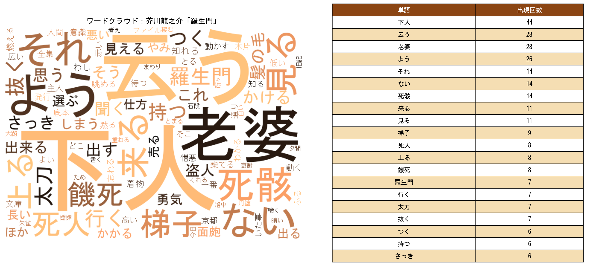

# コラム：ワードクラウドは分析ではない

文責：@tokoroten

自治体や企業が自由記述アンケートの結果を報告する際、「ワードクラウド」がしばしば登場します。カラフルな図が添えられ、「市民の声を分析しました」と報告書に記載される。しかし、ワードクラウドは本当に「分析」と呼べるのでしょうか。

上の図は、架空の自由記述アンケートから作成したワードクラウドです。「政策」「市民」「必要」「問題」「対策」といった単語が並んでいます。見栄えはよく、なんとなく「分析した感じ」がするかもしれません。

しかし、このワードクラウドから何がわかるでしょうか？市民はこの政策に賛成なのか反対なのか？何が問題だと言っているのか？どんな対策を求めているのか？何も読み取れません。

ワードクラウドがやっていることは極めて単純です。テキストを単語に分解し、各単語の出現回数をカウントし、頻度が高い単語ほど大きなフォントで表示する。それだけです。そのため「どのような話題があるか」は分かりますが「どのような意見があるのか」は分かりません。

これをよりわかりやすく示したのが上の図です。芥川龍之介の「羅生門」を形態素解析し、名詞・動詞・形容詞を抽出してワードクラウド（左）と単語頻度リスト（右）を並べました（[青空文庫](https://www.aozora.gr.jp/cards/000879/files/127_15260.html)より）。

右側のリストを見てください。ワードクラウドがやっていることは、この単語頻度リストをフォントサイズに変換しているだけなのです。「下人」が44回、「老婆」が28回、「死骸」が28回……。

ここから何が分かるのでしょうか？「下人」「老婆」「死骸」「髪」という単語が並んでいても、老婆が死骸から髪を抜いていたこと、それを見た下人が最終的に老婆の着物を剥ぎ取って逃げたこと、そしてこの物語が人間の利己主義をテーマにしていること、そういった文脈は完全に失われています。

さらに厄介なのは、ワードクラウドが「わかった気」にさせてしまうことです。カラフルで見栄えのする図が出力されるので、なんとなく分析した感じがする。でも実際には、単語の頻度という表層的な情報しか得られていません。

ワードクラウドとは、単語の出現頻度を可視化する手法に過ぎず、意見の内容そのものは示せません。技術的に自然文の意味解析ができなかった時代、これが「市民の声を自動的・簡便に可視化する」ための唯一に近い手段だったため広く使われました。しかし、単なる頻度分析では、そこから政策に活かせるインサイトを得ることは極めて困難です。

ワードクラウドを報告書に載せて「分析しました」と言うのは、単語の出現頻度を数えただけで意見を理解したことにしてしまう行為です。ワードクラウドはオープンクエッションの「解析」ではなく、単なる「頻度の可視化」に過ぎません。本書で扱うブロードリスニングが目指すのは、この先にある「意見の意味を理解し、構造化する」ことなのです。
